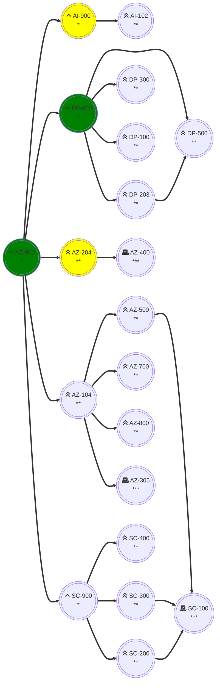

# Cloud-certification-guide
Azure certification patch guide

```mermaid
%%{ init: { 'flowchart': { 'curve': 'catmullRom' } } }%%
flowchart LR

    AZ900(((fa:fa-angle-up AZ-900\n*)))
    style AZ900 fill:green

    AZ204(((fa:fa-angle-double-up AZ-204\n**)))
    style AZ204 fill:yellow

    AZ104(((fa:fa-angle-double-up AZ-104\n**)))
    AZ500(((fa:fa-angle-double-up AZ-500\n**)))
    AZ700(((fa:fa-angle-double-up AZ-700\n**)))
    AZ800(((fa:fa-angle-double-up AZ-800\n**)))
    AZ305(((fa:fa-vote-yea AZ-305\n***)))
    AZ400(((fa:fa-vote-yea AZ-400\n***)))

    AI900(((fa:fa-angle-up AI-900\n*)))
    style AI900 fill:yellow

    AI102(((fa:fa-angle-double-up AI-102\n**)))

    DP900(((fa:fa-angle-up DP-900\n*)))
    style DP900 fill:green
    
    DP100(((fa:fa-angle-double-up DP-100\n**)))
    DP203(((fa:fa-angle-double-up DP-203\n**)))
    DP300(((fa:fa-angle-double-up DP-300\n**)))
    DP500(((fa:fa-angle-double-up DP-500\n**)))

    SC900(((fa:fa-angle-up SC-900\n*)))
    SC200(((fa:fa-angle-double-up SC-200\n**)))
    SC300(((fa:fa-angle-double-up SC-300\n**)))
    SC400(((fa:fa-angle-double-up SC-400\n**)))
    SC100(((fa:fa-vote-yea SC-100\n***)))

    AZ900==>AI900
    AZ900==>DP900
    AZ900==>AZ204
    AZ900==>AZ104
    AZ900==>SC900

    AI900==>AI102

    DP900==>DP500
    DP900==>DP300
    DP900==>DP100
    DP900==>DP203

    DP203==>DP500

    SC900==>SC400
    SC900==>SC300
    SC900==>SC200

    AZ104==>AZ500
    AZ104==>AZ700
    AZ104==>AZ800
    AZ104==>AZ305

    AZ204==>AZ400

    AZ500==>SC100

    SC200==>SC100

    SC300==>SC100
```
