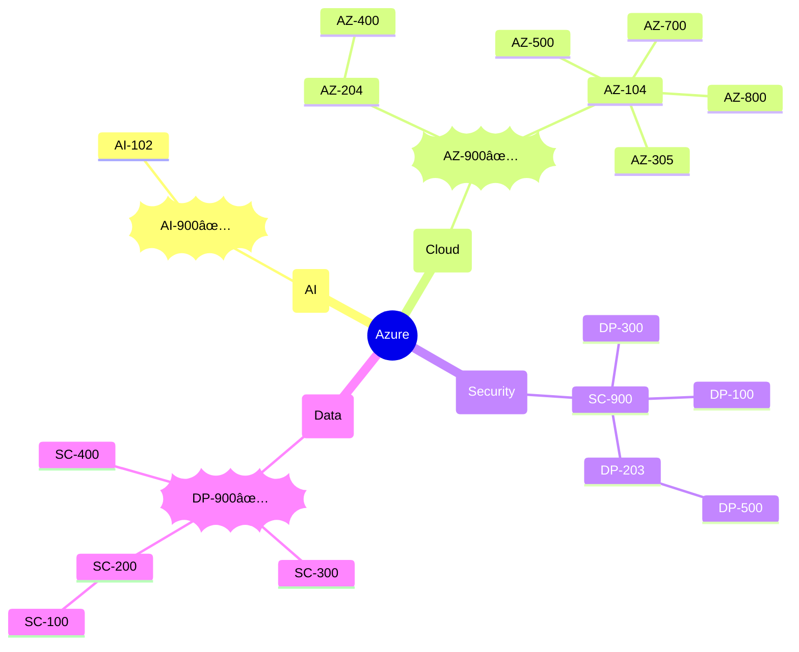
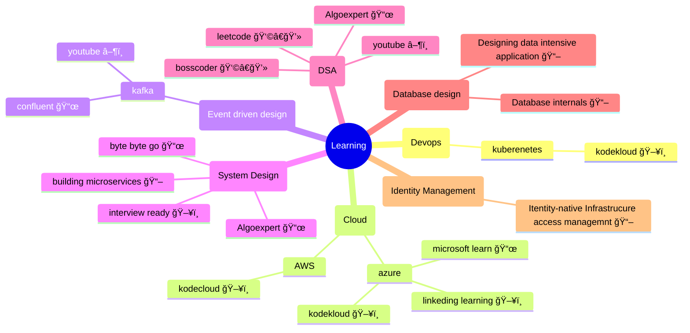

```mermaid
mindmap
root((Azure))
    (AI)
    ::icon(fa fa-robot)
        ))AI-900✅((
        ::icon(fa fa-square-check)
            AI-102
            ::icon(fa fa-calendar-days)
    (Cloud)
    ::icon(fa fa-cloud)
        ))AZ-900✅((
        ::icon(fa fa-square-check)
            AZ-204
            ::icon(fa fa-stopwatch)
                AZ-400
                ::icon(fa fa-stopwatch)
            AZ-104
            ::icon(fa fa-calendar-days)
                AZ-500
                ::icon(fa fa-stopwatch)
                AZ-700
                ::icon(fa fa-stopwatch)
                AZ-800
                ::icon(fa fa-stopwatch)
                AZ-305
                ::icon(fa fa-stopwatch)
    (Security)
    ::icon(fa fa-shield)
        SC-900
        ::icon(fa fa-stopwatch)
            DP-300
            ::icon(fa fa-stopwatch)
            DP-100
            ::icon(fa fa-stopwatch)
            DP-203
            ::icon(fa fa-stopwatch)
                DP-500
                ::icon(fa fa-stopwatch)
    (Data)
    ::icon(fa fa-database)
        ))DP-900✅((
        ::icon(fa fa-square-check)
            SC-400
            ::icon(fa fa-stopwatch)
            SC-300
            ::icon(fa fa-stopwatch)
            SC-200
            ::icon(fa fa-stopwatch)
                SC-100
                ::icon(fa fa-stopwatch)

```

Learning mindmap

```mermaid
mindmap
root((Learning))
    (Devops)
        kuberenetes
            kodekloud 🖥ï¸
    (Cloud)
        azure
            kodekloud 🖥ï¸
            linkeding learning 🖥ï¸
            microsoft learn 📜
        AWS
            kodecloud 🖥ï¸
    (Event driven design)
        kafka
            youtube â–¶ï¸
            confluent 📜
    (System Design)
        interview ready 🖥ï¸
        Algoexpert 📜
        byte byte go 📜
        building microservices 📖
    (DSA)
        Algoexpert 📜
        leetcode 👩â€ğŸ’»
        bosscoder 👩â€ğŸ’»
        youtube â–¶ï¸
    (Database design)
        Designing data intensive application 📖
        Database internals 📖
    (Identity Management)
        Itentity-native Infrastrucure access managemnt 📖
```
